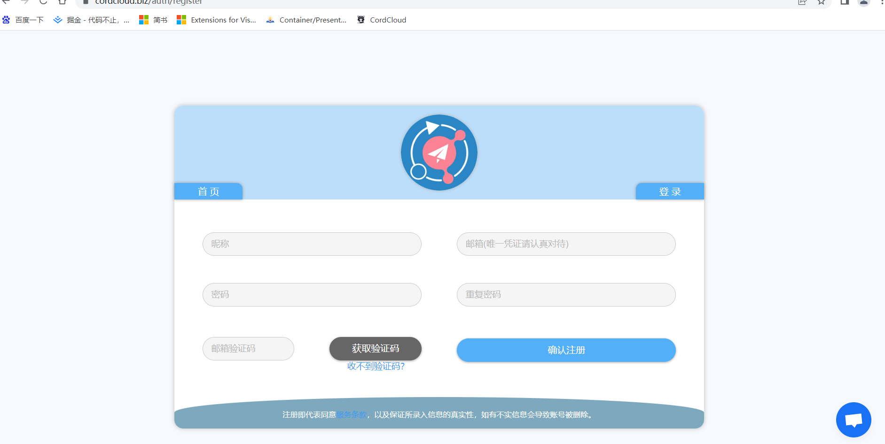
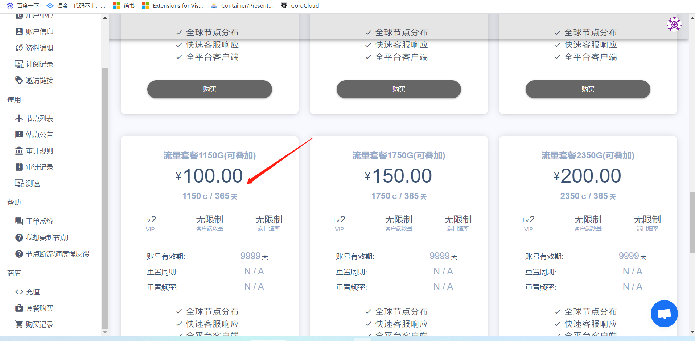
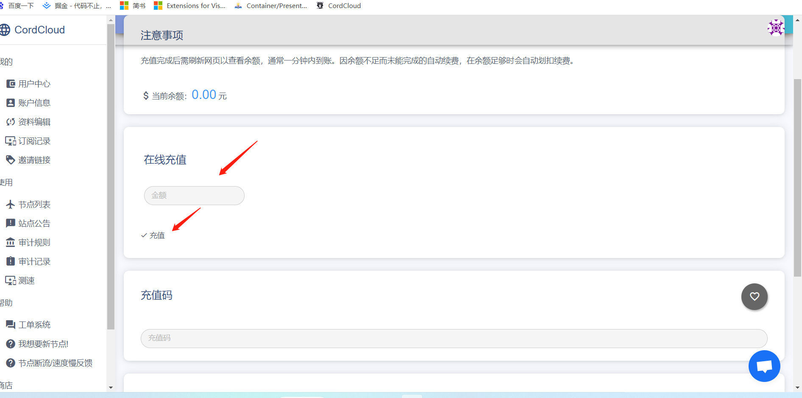
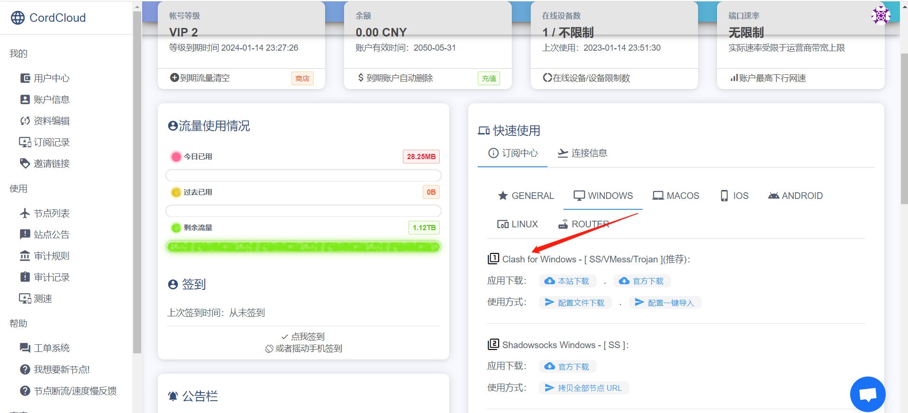
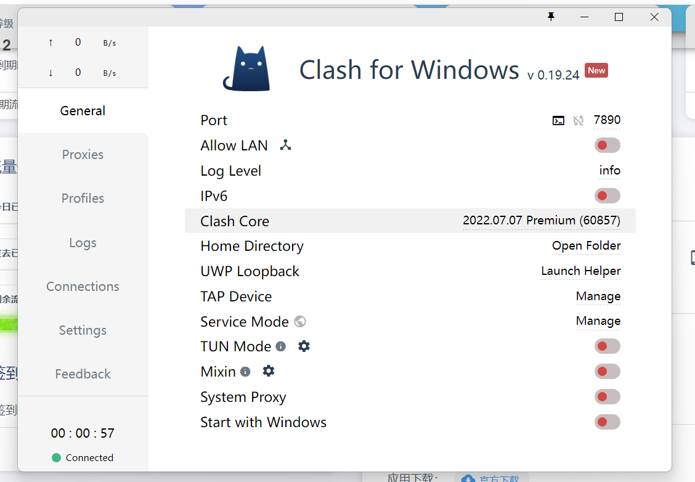
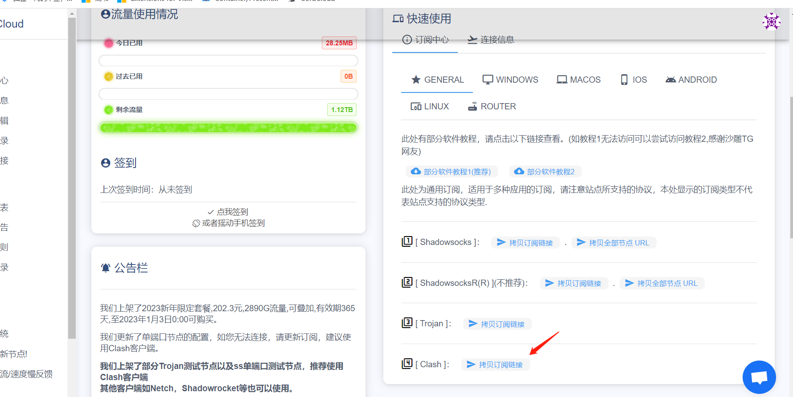
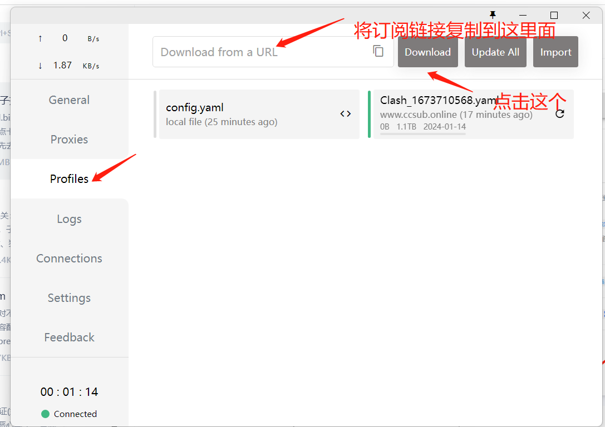
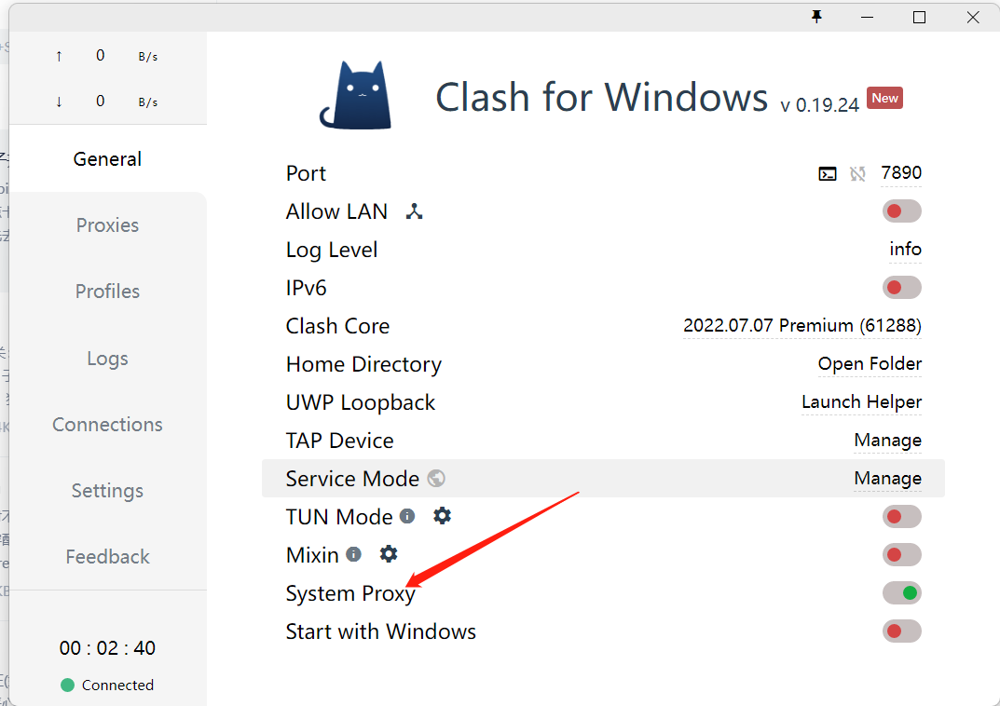
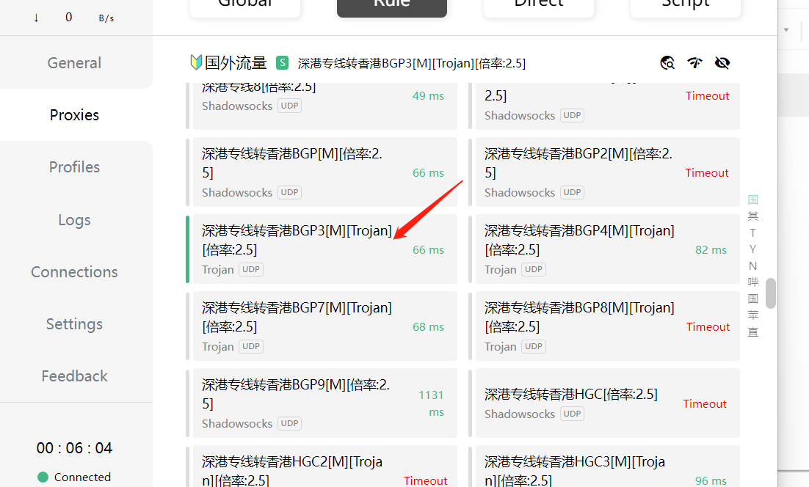

- https://cordcloud.biz/ 登入网址，第一次可能有点卡

- 点击注册

- 注册成功后，可以先去套餐逛逛自己想要购买的套餐，推荐一年1T一百块的

- 点击购买有一个优惠码，可以找已经购买的人要，可以便宜十块钱，如果不差钱的直接充值(支付宝)

- 购买成功后，进入到【用户中心】，选择windows(根据电脑类型)下载梯子软件，windows推荐clash

- 下载完在本地安装，安装成功后会有这个截图

- 先去cordcloud【用户中心】点击【GENNARL】,拷贝订阅连接

- 然后复制到clash梯子里面profiles【download from a URL】里面，点击【download】,新增一个yaml文件，可以点击右边的刷新按钮刷新一下

- 然后点击General，开启【system proxy】

- 然后进入【Proxies】选择代理通道

- 注意一般选择网速较为稳定的通道，比如我在深圳我就选择深港专线转香港通道，其他的看网络的稳定性

- 这时候你的梯子变成黄色的，就说明成功了，可以输入谷歌网址测试一下https://www.google.com.hk/videohp

- 代理成功，记得关电脑之前先把梯子关了