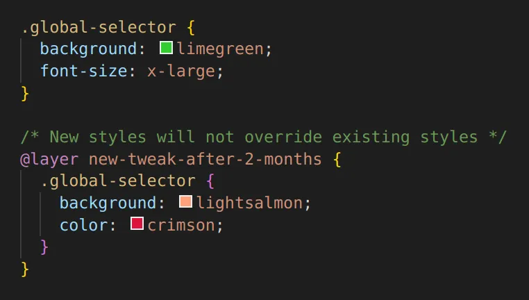
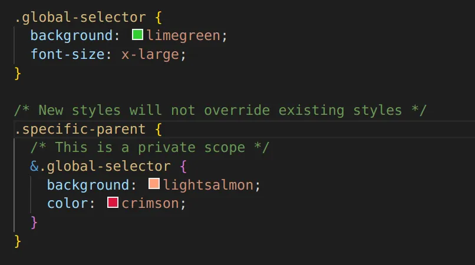

# Tailwind vs 现代 CSS

#### 内联类 VS CSS嵌套

Tailwind是一个非常受欢迎的CSS框架，它有很多令人喜欢的可用来创建用户接口的特性。在本文中，我们不会深入讨论Tailwind，相反，我们将在Tailwind中分离出一些使用内联类的问题，并触及一些新的原生CSS特性，这些特性将彻底改变我们处理这些问题的方式。

#### 内联类

内联类一直是Tailwind的一个备受赞誉的功能。当我在Tailwind上寻求反馈时，我收到了各种各样的意见，其中一个观点吸引了我的注意力。

不容忽视的问题不是明确关于Tailwind的，更多的是关于开发人员对于编码的态度，即：**我可以在一个窗口中编辑所有的内容**

一些开发人员表示，它们喜欢Tailwind，因为他们可以在不切换屏幕的情况下管理他们的CSS和HTML。我对这个观点的强硬立场是：

**我强烈主张管理多个文件或者语法应该是IDE、文本编辑器、终端甚至是多个显示器等工具的责任，而不应该在代码库中解决。**

以上并不是专门针对Tailwind的，更多的是关于对软件开发的专业认知。我不希望有人会反对这个立场，我相信这是一种成熟的态度。

#### 内联类的优势

内联类定义了一个作用域。Rohan完美的描述了Tailwind的这个优势：

与传统CSS项目中无法预测的做事方式相比，这可能是Tailwind最引人注目的优势。

#### 原生CSS中的作用域

幸运的是，现代CSS的作用域与传统CSS不同。原生CSS至少有两种方法来显示Rohan的场景。

两个月后：

**在层叠层中包装想要调整的新样式**

或者最好是

**在嵌套作用域内使用新类**

这两种方法都使用原生CSS，可以实现与Tailwind相同的结果，尽管对于一些人来说，可能需要一些范式转换来适应。

#### 内联类带来的问题

*警告：这部分内容可能会让一些人血压升高*

下面有一些关于内联类的问题。根据您的项目或您选择如何诠释它们，它们可能可以忽略不计或严重。

- **内联类有时候会变得很重：**在撰写本文时，

    [tailwindcss.com](https://tailwindcss.com/)的登陆HTML(只是一个方便的案例研究)使用tailwind的内联类，大小为432.5 KB。类属性及其值构成249KB的数据，这意味着页面大小的57.6%来自内联类。使用现代的原生CSS，大约5%到15%。

- **重HTML会影响你的pagspeed Insights得分：**FE开发者喜欢说“但它已经压缩过了，兄弟”来证明过多的有效载荷是合理的。但是服务器的gzip大小有点误导(这是另一篇文章的内容)。在这种情况下，更重要的问题是由于内联样式导致[DOM Attr节点](https://developer.mozilla.org/en-US/docs/Web/API/Attr)的数据大小而造成的内存消耗。

- **高带宽：**我们生活在一个有免费额度的云服务世界中，所以这对大多数项目来说可能不是一个大问题，但对于超过免费额度的高带宽网站，繁重的HTML可能会产生额外的成本，这取决于你的云提供商。**CSS样式表是专门为在HTTP概念期间缓存而设计的。**Tailwind的内联类是HTML文档的一部分，它通常有更频繁的更改，并且通常不像CSS样式表那样缓存。

- **重复的样式方言：**Tailwind将允许您定义内联类语法，这是一种类似于CSS的简化方言。这些类链接到框架CSS规则。它本身不是直接的复制，但它是CSS的额外权重，也在框架代码的CSS中表示。

*您可以选择使用\@apply指令将您的Tailwind样式移动到类中，尽管对于许多人来说，这可能会完全减少使用Tailwind的目的。*

#### CSS嵌套改变了一切

因为嵌套作用域是私有的。

- **不必使用类定义每个元素**，只需你的判断并保持合理即可。
- **不再需要遵循BEM、OOCSS或任何其他传统的CSS方法。**那些东西现在都死了。

CSS嵌套和相对选择器意味着我们不仅比CSS框架定义更少的内联类，而且与传统的CSS项目相比，我们定义的内联类也更少。

#### 结论

如果您正在以老派的方式使用CSS，请停止。想办法跟上时代。也许下面的内容会有所帮助，但这已经超出了范围(没有别的意思):

- [caniuse.com](https://caniuse.com/?search=nesting)

- [PostCSS](https://postcss.org/)

- [Nesting](https://www.npmjs.com/package/postcss-nesting)

在过去的15年里，CSS库和框架主要依赖于过多的内联类。Tailwind也不例外。

*恕我直言，像Tailwind这样的CSS框架似乎没有必要嵌套CSS。我建议根据自己的需要选择一种或另一种方法。*

Tailwind是巨大的，我相信Tailwind对于CSS来说比React对JS/TS来说更大。因此，不可避免地会有许多思想领袖和暴徒用甜言蜜语来打消本文中提出的许多担忧。

**首席技术官，没人让你停止使用Tailwind。作为一名开发人员，对自己的能力和知识的推崇比你使用的工具更重要。**这只是知识的另一个来源。

这里没有什么新东西。当[*CSS-in-JS*](https://medium.com/dailyjs/what-is-actually-css-in-js-f2f529a2757)出现时，我们也遇到过类似的情况，一开始，开发人员注意到它复制了CSS的足迹，并且在某种程度上违背了缓存和无效的概念(我不完全确定这个问题是否已经解决)。

我希望这篇文章能给CSS的现实问题和解决方案带来一些启发。

这里的魔法是“唤醒”而不是“阻止”。

谢谢你的阅读:)
