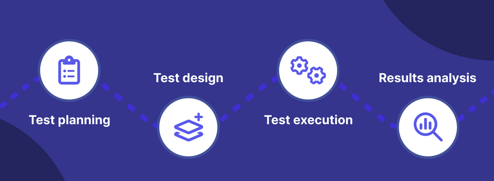

# What is End-to-End Testing?

## **什么是端到端测试?**

端到端测试是一种软件测试技术，通过模拟真实世界的用户场景和复制实时数据，从头到尾验证整个软件应用程序的功能和性能。它的目标是识别所有组件集成时出现的错误，确保应用程序作为一个统一的实体交付预期的输出。

端到端测试也称为E2E测试。得益于端到端测试，测试人员可以从最终用户的角度深入了解应用程序的功能，从而在发布前更全面地了解软件质量。

端到端测试是必不可少的，因为现代软件已经变得复杂，几十个系统同时相互交互。即使这些组件单独运行非常良好，但由于组件之间的通信错误，它们在集成时仍可能失败。端到端测试用于验证通过AUT的信息流，包括所有可能的路径和依赖关系。如果软件组件和/或子系统之间的任何“接触点”存在问题，测试人员可以很容易地找到根本原因并立即进行故障排除。

测试人员希望通过E2E测试获得最高级别的覆盖率。应用程序的所有子系统或组件，如用户界面、应用服务器、数据库，以及应用程序可能与之交互的任何外部系统，都应该进行端到端测试。

[尝试使用Katalon平台进行端到端测试](http://webtrans.yodao.com/server/webtrans/tranUrl?url=https%3A%2F%2Fkatalon.com%2Fsign-up&from=auto&to=auto&type=1&product=mdictweb&salt=1690716211393&sign=f14f7479b7f8341f9e0db347aa6c56ac)

 **端到端测试示例**

下面是一个电子商务网站端到端测试的例子。

在这种情况下，客户从网站上购买产品，付款并收到确认电子邮件。必须执行以下测试，以确保功能按预期运行：

1. 验证产品页面的功能和产品选择功能
2. 客户信息表单中的数据验证功能
3. 付款信息验证
4. 验证支付处理功能
5. 验证付款是否成功，网站将显示确认消息。
6. 检查客户的电子邮件收件箱以获得确认电子邮件。
7. 确认电子邮件中包含正确的购买细节(例如：产品名称、数量、价格、订单号)。
8. 在网站上检查客户的帐户，并确认该购买在订单历史记录中列出。

在这里，我们验证整个购买过程，从选择产品到接收确认电子邮件。我们还检查网站组件(购物车、支付系统、电子邮件通知)是否都能顺利地交互。

## **端到端测试的好处**

端到端测试更加可靠并被广泛使用，因为有以下好处:

- **跨多个应用程序级别的质量管理**：现代应用程序建立在由多层和互连工作流组成的复杂体系结构上。这些层可以单独工作，但一旦连接起来就会相互冲突。端到端测试可以验证这些单独的层和组件之间的交互。
- **后端测试**：E2E测试首先验证后端层，尤其是应用程序的数据库，它将关键信息提供给其他层，以便应用程序工作。
- **确保跨环境的应用程序质量一致**：端到端测试验证前端，确保应用程序在广泛的浏览器、设备和平台上按预期工作。为此，经常进行[跨浏览器测试](http://webtrans.yodao.com/server/webtrans/tranUrl?url=https%3A%2F%2Fkatalon.com%2Fresources-center%2Fblog%2Fcross-browser-testing&from=auto&to=auto&type=1&product=mdictweb&salt=1690716211393&sign=12f01eac40a0b8e6fafa2a69f97482b3)。
- **第三方应用程序测试：**将外部系统集成到应用程序中，以执行高度特定的任务。端到端测试确保了外部和内部系统之间的兼容性，以及它们之间的数据通信。

[尝试跨浏览器测试与Katalon平台免费试用](http://webtrans.yodao.com/server/webtrans/tranUrl?url=https%3A%2F%2Fkatalon.com%2Fopen-testops&from=auto&to=auto&type=1&product=mdictweb&salt=1690716211393&sign=9e260ecb3a1c87768629df69d214af68)

 

## **端到端测试生命周期**

端到端软件测试生命周期由四个部分组成：测试规划、测试设计、测试执行和结果分析。

- **测试规划：**此阶段发生在集成测试完成时。在 [测试计划](https://katalon.com/resources-center/blog/test-plan) 中，测试目标是基于最初的客户需求和应用程序体系结构概述的。
- **测试设计：**根据需求搭建合适的测试环境。通常，测试环境已经为以前的测试运行配置好了，测试人员可以利用这些现有的配置。同时进行风险分析和使用分析，以便更有效地分配合适的资源来实现测试目标。在那之后，测试人员开始创建必要的测试用例，利用自动化测试工具来最小化花在测试设计上的时间
- **测试执行：**测试用例在本地和远程执行。监控测试进度以确保与原始测试计划的一致性
- **结果分析：**分析测试结果，找出bug的根本原因。这些发现将被发送给开发团队，以便立即进行干预。然后实施项目回顾，以评估过程并讨论改进的方向。

 

## **端到端测试的类型**

### **水平端到端测试**

水平端到端测试是终端用户听到“端到端测试”时所想到的。在这种方法中，测试人员关注于确保应用程序中的每个单独的工作流正确工作。

上面的电子商务示例正是从最终用户的角度来看的水平端到端测试。要执行的测试包括验证产品搜索特性、产品页面功能、产品订购步骤和发货详细信息。

换句话说，通过水平端到端测试，QA专业人员希望将自己置于用户的位置，并测试他们如何体验应用程序的每个面向客户的方面。

阅读更多： [手动测试：综合指南]( [Manual Testing: A Comprehensive Guide](https://katalon.com/resources-center/blog/manual-testing) )

### **垂直端到端测试**

垂直端到端测试是一种更技术性的方法。这是测试人员听到端到端测试时的想法。与只体验前端的终端用户不同，测试人员还处理后端，他们希望确保正确的数据在正确的时间被传输到正确的位置，以便所有保持应用程序运行的后台进程都能顺利执行。

在电子商务网站环境中，垂直端到端测试包括验证账户注册和验证过程、账户相关功能、产品数据库、产品更新以及最终的UI(前端)。这些垂直端到端测试按顺序、分层顺序进行。

## **端到端测试成功指标**

一些用于端到端测试的测试指标包括:

- **测试用例准备状态：**用于确定准备中的测试用例的具体位置，与计划的测试用例进行比较。
- **测试进度跟踪：**测试进度应该以每周为基础进行跟踪。此步骤提供测试完成百分比的常规细节，例如通过/失败、执行/未执行、有效/无效测试用例，等等。
- **缺陷状态及详细信息：**它给出了每周打开和关闭缺陷的百分比。同样，每周的缺陷分布是基于严重性和优先级的。
- **环境的可用性：**每天用于测试的实际操作小时数和计划的小时数。

## **端到端测试vs功能测试**

端到端测试不仅仅是几个单元测试和[功能测试]( [functional tests](https://katalon.com/resources-center/blog/functional-testing) )串在一起，它们更复杂，风险更大。我们列出了功能测试和E2E测试之间的主要区别，以进一步说明这一点。

| **方面** | **功能测试**                       | **端到端测试**                     |
| -------- | ---------------------------------- | ---------------------------------- |
| 范围     | 测试仅限于一段代码或一个应用程序。 | 跨多个应用程序和用户组进行测试。   |
| 目标     | 确保测试的软件符合验收标准。       | 确保流程在进行更改后继续工作。     |
| 测试方法 | 测试单个用户与应用程序交互的方式。 | 测试多个用户跨应用程序工作的方式。 |
| 验证什么 | 验证每个测试的输入和输出结果。     | 确认流程中的每个步骤都已完成。     |

 

## **端到端测试vs集成测试**

端到端测试与集成测试非常相似，而且它们确实在几个方面重叠。以下是它们之间的一些主要区别：

| **方面**   | **集成测试**                                                 | **端到端测试**                                               |
| ---------- | ------------------------------------------------------------ | ------------------------------------------------------------ |
| 角度来看   | 技术团队的观点                                               | 最终用户的观点                                               |
| 目标       | 确保应用程序组件协同工作                                     | 确保用户体验的一致性                                         |
| 范围       | 一个应用程序中的多个组件                                     | 范围可能跨越应用程序的整个技术堆栈                           |
| 成本       | 实现成本更低                                                 | 更昂贵的实现，因为硬件和软件需要最好地模拟现实世界的场景     |
| 所需的时间 | 比端到端测试快([200次测试]([for 200 tests](https://softwareengineering.stackexchange.com/questions/282033/how-do-you-scale-your-integration-testing))不到1小时) | 比集成测试长([可能需要4 - 8小时]([may take up to 4 - 8 hours](https://medium.com/briebug-blog/im-so-done-with-e2e-testing-until-now-b10d03c70e56#:~:text=Speed is a big problem,a large suite of tests.))) |

 

## **端到端测试主要挑战**

在复杂的工作流程中检测错误当然有其挑战。

#### 端到端测试可能非常耗时

创建必要的测试套件，并将它们与应用程序中的用户导航相匹配，可能需要运行数千个测试，并且非常耗时。通常QA团队利用自动化测试工具来协助他们完成这些任务。这些工具应该为测试人员提供协作能力，以便他们能够与开发团队就测试内容保持一致。

#### 设置正确的测试环境

访问适当的测试环境并不总是那么简单，可能包括必须安装本地代理和登录到虚拟机。为了减少困难，最好采用云上测试系统，让测试人员可以访问更广泛的平台和环境来执行测试，从而节省对物理机器的初始投资。

 

## **端到端测试最佳实践**

#### 首先关注应用程序的关键工作流

确定应用程序的关键部分的优先级是很重要的。关注大多数人在应用程序中使用的内容，并提前为此创建测试。

在选择了最关键的工作流之后，开始将它们分解成更小的步骤。这为您提供了一个更专注于如何执行测试的视角，并最大限度地减少了不相关测试的数量。

#### 避免异常测试

异常测试是在遇到错误条件或异常事件时测试行为或系统的过程。尽管这是一种强烈推荐的实践，但端到端测试并不适合异常测试。这种类型的测试可以识别错误发生，但不一定告诉我们错误发生的原因或它将如何影响应用程序或系统。

#### 构建端到端测试，尽量减少UI的脆弱性

当涉及到端到端测试时，通常会涉及UI测试，并且由于从最终用户的角度与系统交互的脆弱性，这些类型的测试经常失败。网络问题、服务器速度慢和许多其他方面都会影响测试结果并产生误报。

为了处理这种不稳定，建议在执行测试时考虑意外的系统问题。例如，使用 [Katalon](https://katalon.com/resources-center/blog/handle-selenium-wait) ，测试人员可以利用Smart Wait特性等待，直到屏幕上的所有元素都加载完毕，然后再继续预定义的操作。

#### 利用自动化测试

与其他类型的测试不同，端到端测试包括从端到端测试应用程序的功能，涵盖所有可能的用户场景、交互和接口。它需要团队之间更高层次的协调和协作，因为它涉及到测试各种模块、api和系统的集成。

对于端到端测试，我们需要的不仅仅是测试自动化工具。我们需要一个软件质量管理平台。这样的平台提供了一个全面的测试管理系统，允许测试人员在一个地方管理和组织测试用例、需求、测试计划和缺陷。

更多探索:十大最佳[端到端测试工具](  [End-to-End Testing Tools](https://katalon.com/resources-center/blog/end-to-end-e2e-testing-tools-frameworks) )和框架

 

## **端到端测试自动化与Katalon平台**

 [Katalon](https://katalon.com/katalon-studio)是一个优秀的软件质量管理平台，可以使您的端到端测试不那么复杂。有了Katalon，软件团队可以对他们的测试活动有一个端到端的视角，从测试计划的协作、测试创作、测试执行、测试工件管理，到测试分析和报告。

Katalon支持广泛的测试类型，开发人员和手动测试人员都可以轻松地自动化web, API，桌面和移动应用程序的UI或功能测试，所有这些都在一个地方。跨软件测试生命周期使用的工具可以与Katalon本地集成，为您提供全面的测试体验。(您现有的CI/CD管道和测试管理工具)。

Katalon有几个值得注意的功能来支持您的端到端测试活动:

#### 云上测试执行

跨多个浏览器和操作系统执行端到端测试可能是一项艰巨的任务，特别是在设置物理机器以执行测试时。此过程可能非常耗时且资源密集，从而导致端到端测试过程的延迟。

通过利用Katalon，您可以轻松地在云上同时在多种浏览器、设备和操作系统上运行测试，确保全面的测试覆盖率。此功能可帮助组织节省时间和资源，同时提高web应用程序的质量。

#### Katalon记录器

不同的用例经常以不同的顺序和变化混合在一起。但是我们可以把每一组用例称为用户旅程。从技术上讲，用户旅程是一系列步骤的集合，其中每个步骤对应于一个用户操作。总的来说，它们代表一个典型的用户会话。

Katalon在网络上提供了记录器功能，以帮助您完成创建用户旅程的任务，而无需任何麻烦。记录器基本上监视并记录应用程序上的所有动作，以便您可以专注于创建旅程本身。

#### 内置的关键词

用户旅程通常由数百个步骤组成。当一个测试用例——它代表用户的旅程——失败时，可能很容易找出表面原因(例如，Web元素属性的变化)。但是，仅仅根据测试失败的事实，很难诊断出真正的原因。这可能是因为当前页面与记录的页面不同，因为在某些时候测试用例偏离了正确的轨道。

为了确保用户的旅程必须经过某些里程碑，测试预言器是必要的。测试预言机是指一种确保测试用例按预期执行的机制。在Katalon中，提供了一组实现这一概念的内置关键字。您可以根据期望包含的某些文本断言或验证web元素，或者根据某些期望属性和许多其他类型的期望来断言或验证其属性。

#### 自定义关键字

根据应用程序的业务逻辑，可能存在跨不同页面发生的行为，但仅在某些已知特征上有所不同。在这种情况下，最佳实践是在行为模板中捕获这些行为，该模板可以在必要时填充特定信息。

在Katalon中，可以定义一个[自定义关键字]( [custom keyword](https://docs.katalon.com/katalon-store/docs/publisher/build-CK-settings.html)  )来表示这样的行为模板。一旦定义，它就可以在不同的测试用例甚至不同的测试项目中被重用。您甚至可以通过Katalon Store共享您的自定义关键字作为插件，以便其他人可以从中受益。