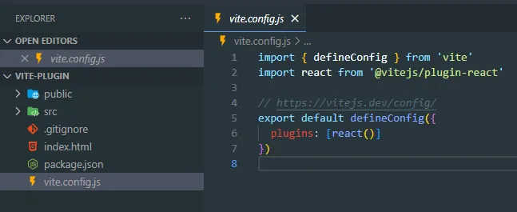
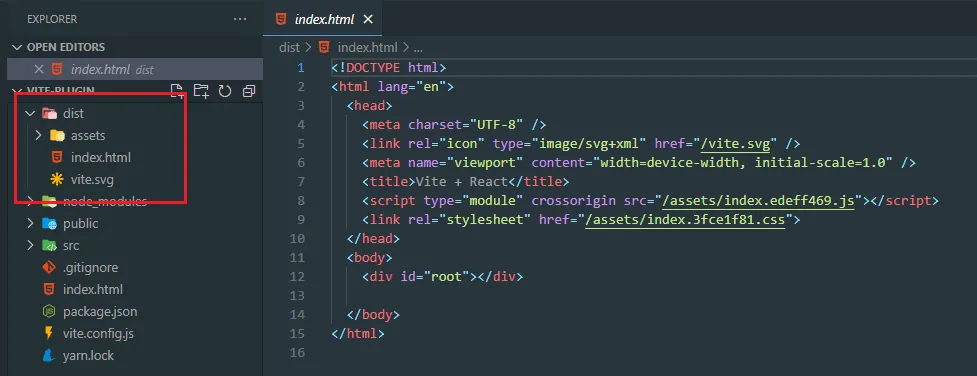
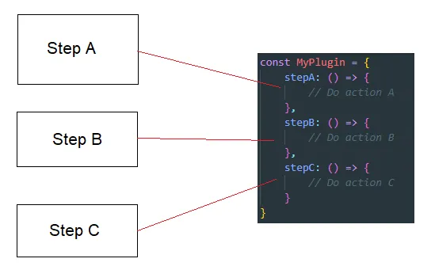
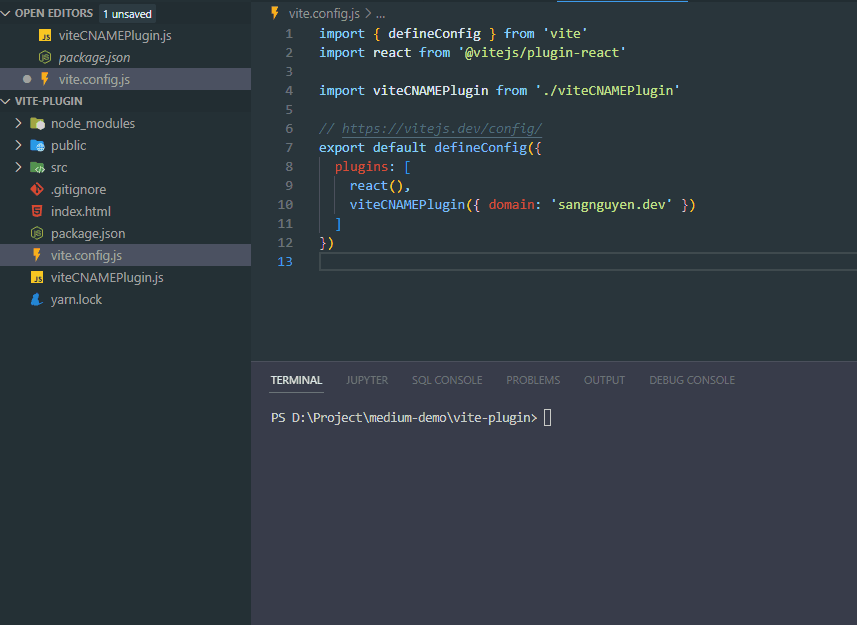
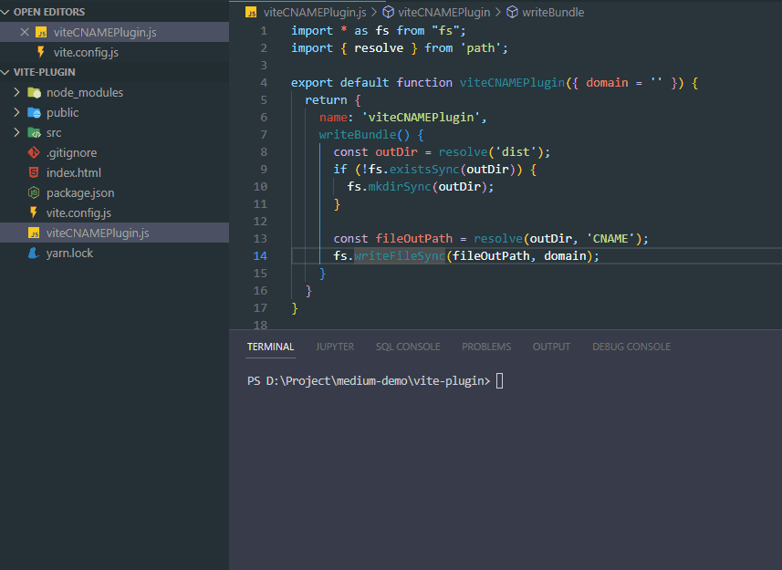
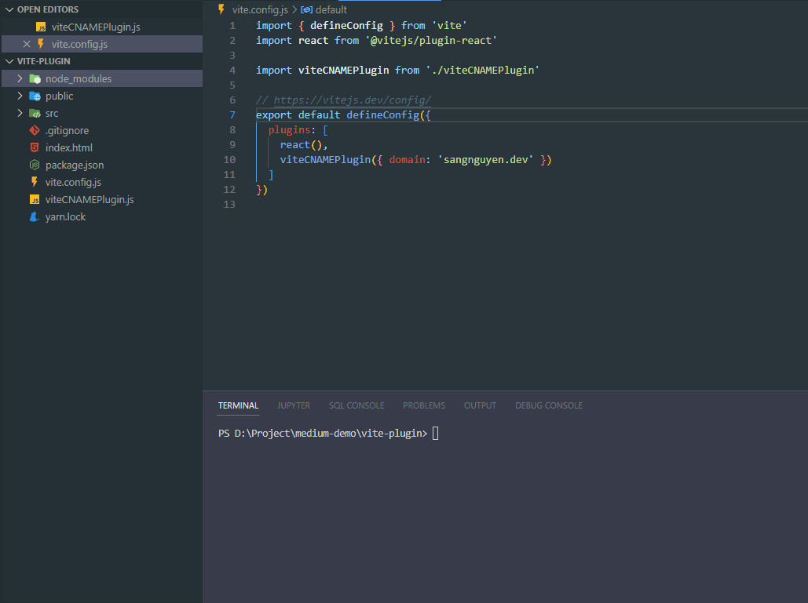

Vite 是一款令人难以置信的现代 Web 项目构建工具。除了基本配置之外，Vite 还让我们可以通过第三方插件做更多的事情。在这篇文章中，我将向您展示如何编写自己的 Vite 插件。

# 我们要做的插件是什么？

在开始构建 Vite 插件之前，我先谈谈这个插件的主要功能。

我们需要在`dist`或`build`目录创建一个`CNAME`文件，文件内容存放我们的域名字符串。在Vite项目中，我们可以通过在`public`目录下创建CNAME文件来轻松完成这个需求。但是因为这篇文章我们需要做一个Vite插件，所以我会实现一个vite插件。有了这个插件，我们就可以自动生成CNAME文件， 除了不需要创建文件之外，该插件还允许用户添加一些逻辑来定义域名，例如条件、环境......

# 创建Vite项目

我们需要先创建一个 Vite 项目。我们有多种方式来创建Vite项目。在本文中，我将使用yarn create命令及React模板创建一个 Vite 项目（您可以使用 Vue、其他模板或不使用模板）。

```
yarn create vite vite-plugin --template react
```
这是通过该命令创建的项目：



我们可能会在文件中vite.config.js看到plugins属性（`(Plugin | Plugin[] | Promise<Plugin | Plugin[]>)[]`）。上图中已经将react插件添加进plugins中了。我们将创建一个新插件并将其添加到plugins，如下所示。让我们运行`yarn build`构建命令来展示打包后的结果。




如您所见，项目根目录下将生成`dist`目录存放构建产物，其中包含项目的所有输出文件。我们插件的任务是在构建过程中自动在此目录中创建一个 CNAME 文件。我们开始做吧！

# 让我们创建我们的插件

这一步我们就来看看创建Vite插件的方式和基本原理。从[Vite插件文档](https://cn.vitejs.dev/guide/api-plugin.html)来看，Vite插件返回一个对象。在这个对象中，我们可以定义我们的插件功能。但 Vite 还建议我们创建一个工厂函数，用于返回真正的插件对象而不仅仅返回一个对象。因为该函数允许用户自定义插件行为的选项。因此，在本文中，我将我们的插件定义为工厂函数。我将在根目录的“viteCNAMEPlugin.js”文件中创建我们的插件。源代码如下：

```js
export default function viteCNAMEPlugin({ domain = '' }) {
  return {
    name: 'viteCNAMEPlugin'
  }
}
```

要使用这个插件，我们只需要把它添加到vite.config.js.

```js
import { defineConfig } from 'vite'
import react from '@vitejs/plugin-react'

import viteCNAMEPlugin from './viteCNAMEPlugin'

// https://vitejs.dev/config/
export default defineConfig({
  plugins: [react(), viteCNAMEPlugin({ domain: 'sangnguyen.dev' })]
})
```

再次运行yarn build命令。来看看结果吧：


它运行成功。下一步，我们将在Vite插件开发中使用插件钩子函数。


# 使用vite插件钩子函数实现我们的需求

在上一部分中，我们已经知道Vite插件被定义为一个对象。在这一部分中，我们将研究这个对象。首先，我们需要了解一下Vite中的`build hooks`。

每次我们运行构建命令时，Vite都会运行许多步骤来完成这个过程。每个步骤都有其使命（例如：准备构建、加载配置、构建、捆绑……）。Vite为我们提供了`build hooks`，它对应于构建过程中的构建步骤。通过这些钩子函数，我们可以将我们的逻辑添加到构建过程中。示例图片：



在 Vite 中，我们有通用钩子（也就是`Rollup构建钩子`）和Vite独有钩子。在本文中，这两种类型的钩子我们都将会使用到。

关于通用钩子，Vite文档是这样写的

> 在开发过程中，Vite 开发服务器创建一个插件容器，该容器以与Rollup 相同的方式调用Rollup Build Hooks 。

这意味着我们可以遵循Rollup的构建钩子来实现我们的需求。您可以看一下这个页面：

[Rollup（中文网）](https://www.rollupjs.com/) 或者[Rollup（国外官网）](rollupjs.org) 

>Rollup 是 JavaScript 的模块捆绑器，它将小段代码编译成更大、更复杂的代码……


在我们的插件中，我将使用钩子`writeBundle`来生成`CNAME`文件。我选择这个钩子是因为这是输出生成阶段的最后一个钩子。我认为这是生成 CNAME 文件的好阶段。为此，我们只需要在对象插件中添加一个`writeBundle`属性，属性值是一个函数。在此函数中，我们将在构建目录中创建一个 CNAME 文件。这很容易做到，这是我们添加此属性后的插件源代码：

```js
import * as fs from "fs";
import { resolve } from 'path';

export default function viteCNAMEPlugin({ domain = '' }) {
  return {
    name: 'viteCNAMEPlugin',
    writeBundle() {
      const outDir = resolve('dist');
      if (!fs.existsSync(outDir)) {
        fs.mkdirSync(outDir);
      }

      const fileOutPath = resolve(outDir, 'CNAME');
      fs.writeFileSync(fileOutPath, domain);
    }
  }
}
```

这是一个简单的功能。它的作用只是在位置“./dist/CNAME”创建一个新文件，内容为“domain”的值。我们来测试一下吧！



good！我认为我们已经达到了本文的目标，在`dist`目录中创建内容为`sangnguyen.dev`的 CNAME 文件。我们创建了一个插件，允许用户自动创建 CNAME 文件。但你还记得我上面说的吗？我说过我们将同时使用通用钩子和Vite独有钩子。目前，我们只使用通用中的一个`writeBundle`钩子。在下一部分中，我们将使用Vite独有钩子。

# 使用configResolved钩子优化我们的插件

在本部分的标题中，我提到了`configResolved`钩子。它是Vite独有钩子之一。但在使用这个钩子之前，我们先谈谈我们插件的缺点。在我们的插件中，我们将构建目录固定为`dist`。如果用户改变了Vite.config.js的build.outDir属性，就会出现问题。让我们在这里看看这个演示：



如您所见，问题正在发生。构建命令完成后，我们有两个目录。一个是`build`目录，仅包含了构建后的代码文件。一个是`dist`目录，仅包含 CNAME 文件。我们有很多方法来解决这个问题。其中之一是为我们的插件传递一个参数。此参数将定义输出目录位置。但我不太喜欢这个解决方案。所以我向您推荐另一种解决方案。这是为了使用“configResolved”挂钩来获取构建配置值。

“configResolved”钩子是一个带有参数的函数。该参数值是“resolvedConfig”。根据Vite文档，我们只需要创建一个全局变量，并在这个hook中将config值赋给这个变量即可。然后我们就可以在其他钩子中访问这个config。我们按照此方案改动我们的插件：

```js

import * as fs from "fs";
import { resolve } from 'path';

let viteConfig = null;

export default function viteCNAMEPlugin({ domain = '' }) {
  return {
    name: 'viteCNAMEPlugin',
    configResolved(resolvedConfig) {
      viteConfig = resolvedConfig;
    },
    writeBundle() {
      const outDir = resolve(viteConfig?.build?.outDir || 'dist');

      if (!fs.existsSync(outDir)) {
        fs.mkdirSync(outDir);
      }

      const fileOutPath = resolve(outDir, 'CNAME');
      fs.writeFileSync(fileOutPath, domain);
    }
  }
}
```

我们创建了一个新的全局变量viteConfig。在`configResolved`钩子中，我们只需要将参数分配给viteConfig变量即可。然后我们可以调用viteConfig.build.outDir来访问构建输出目录。我们来测试一下：



我们有三个测试场景。第一种情况是正常情况。第二种情况是通过构建命令改变outdir。最后一种情况是vite.config.js文件改变outdir。如果在这三种情况下都达到我们的期望目标。我认为我们已经完成了我们的插件。

# 结论

Vite 是一个现代构建工具。我想它以后会成长得更多。我希望这篇文章能为您提供一些有用的信息。掌握了插件知识，您就可以创建自己的 Vite 插件了。
